# Commander Architecture

Comprehensive architecture documentation for the Commander KV Storage Abstraction Service.

## Table of Contents

1. [System Overview](#system-overview)
2. [High-Level Architecture](#high-level-architecture)
3. [Component Architecture](#component-architecture)
4. [Data Flow](#data-flow)
5. [Database Backend Architecture](#database-backend-architecture)
6. [Deployment Architecture](#deployment-architecture)
7. [Security Architecture](#security-architecture)
8. [Technology Stack](#technology-stack)

---

## System Overview

Commander is a unified KV storage abstraction service that provides a single REST API interface for multiple database backends.

### Key Characteristics

- **Language**: Go 1.25.5
- **Framework**: Gin Web Framework
- **Backends**: BBolt (embedded), Redis (in-memory), MongoDB (cloud)
- **Target**: Edge devices and cloud deployments
- **Architecture Pattern**: Hexagonal (Ports and Adapters)

---

## High-Level Architecture

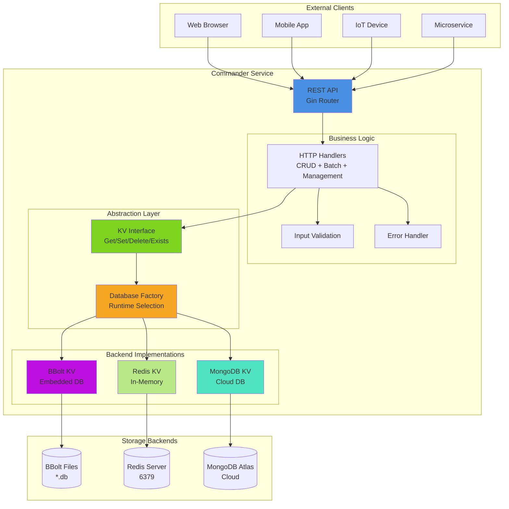

---

## Component Architecture

### Layer-by-Layer View

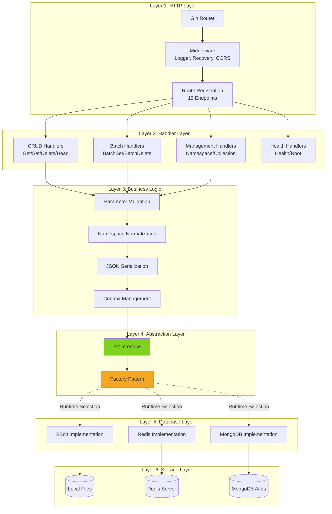

### Package Structure

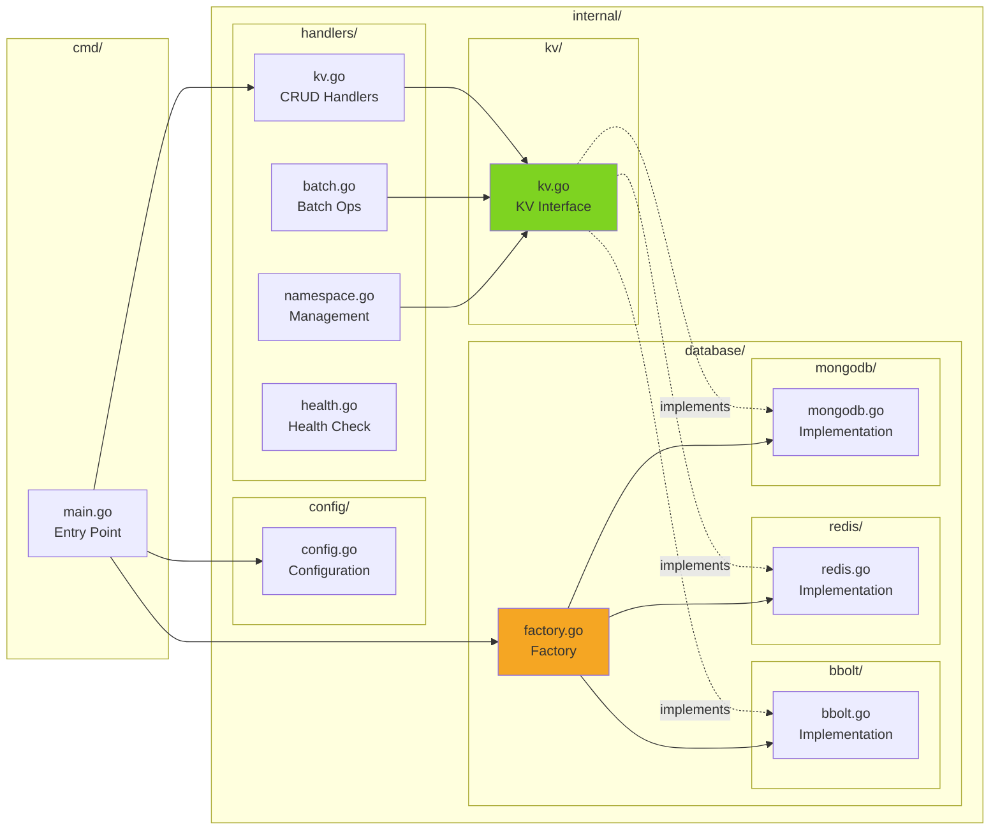

---

## Data Flow

### GET Request Flow

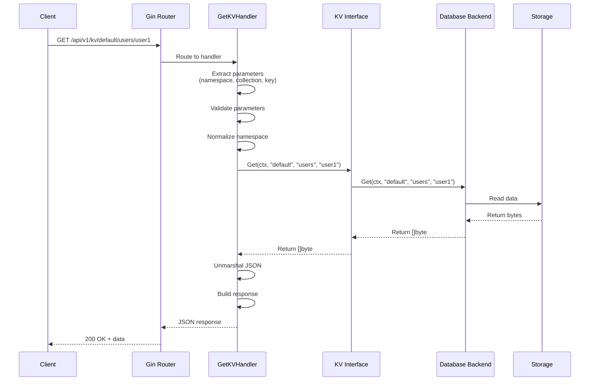

### POST Request Flow

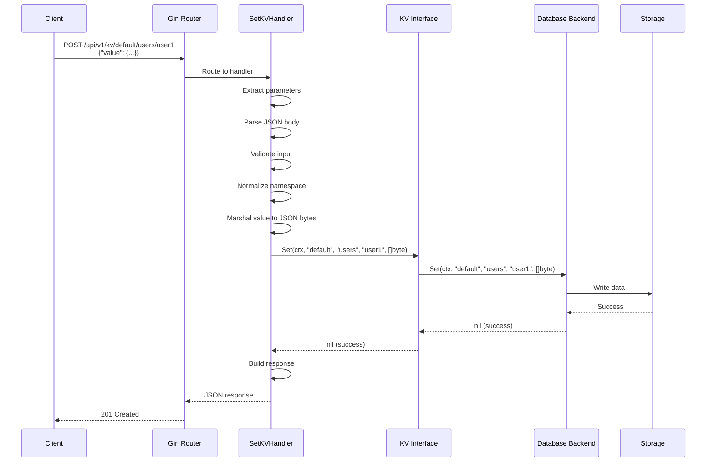

### Batch Operation Flow

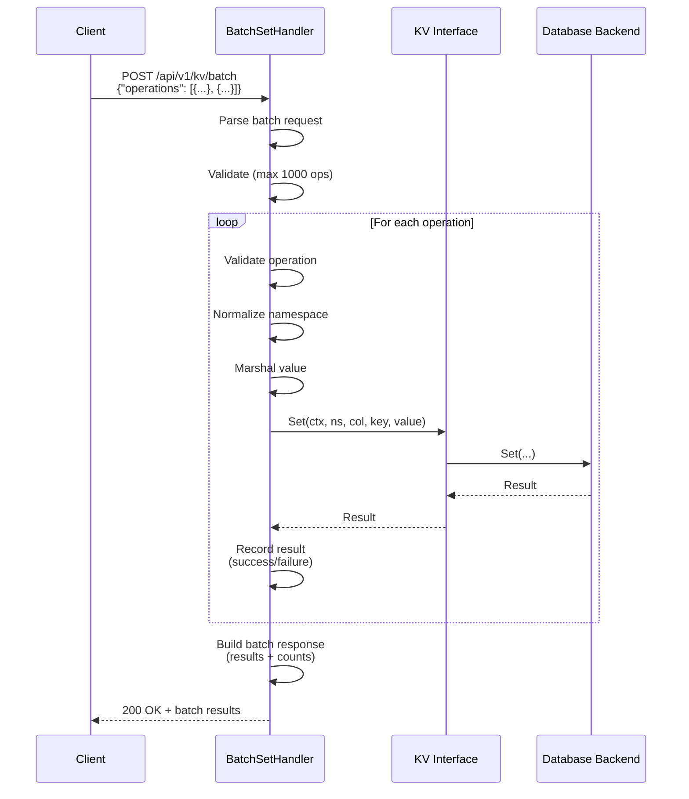

---

## Database Backend Architecture

### Three Backend Implementations

```mermaid
graph TB
    subgraph "KV Interface Contract"
        Interface[Interface: KV<br/>Get/Set/Delete/Exists/Close/Ping]
    end

    subgraph "BBolt Backend"
        BBoltKV[BBolt KV Implementation]
        BBoltConn[File-based Connection]
        BBoltData[(Namespace Files<br/>default.db<br/>production.db)]
        
        BBoltKV --> BBoltConn
        BBoltConn --> BBoltData
        
        BBoltNote[Data Model:<br/>Namespace → File<br/>Collection → Bucket<br/>Key → Bucket Key]
    end

    subgraph "Redis Backend"
        RedisKV[Redis KV Implementation]
        RedisPool[Connection Pool]
        RedisServer[(Redis Server<br/>:6379)]
        
        RedisKV --> RedisPool
        RedisPool --> RedisServer
        
        RedisNote[Data Model:<br/>Key: ns:col:key<br/>Value: JSON string]
    end

    subgraph "MongoDB Backend"
        MongoKV[MongoDB KV Implementation]
        MongoPool[Connection Pool]
        MongoAtlas[(MongoDB Atlas<br/>Cloud)]
        
        MongoKV --> MongoPool
        MongoPool --> MongoAtlas
        
        MongoNote[Data Model:<br/>Namespace → Database<br/>Collection → Collection<br/>Doc: {key, value}]
    end

    Interface -.->|implements| BBoltKV
    Interface -.->|implements| RedisKV
    Interface -.->|implements| MongoKV

    style Interface fill:#7ED321
    style BBoltKV fill:#BD10E0
    style RedisKV fill:#B8E986
    style MongoKV fill:#50E3C2
```

### Data Organization Comparison

```mermaid
graph TD
    subgraph "Logical Structure"
        NS[Namespace: 'default']
        COL[Collection: 'users']
        KEY[Key: 'user1']
        VAL[Value: JSON]
        
        NS --> COL
        COL --> KEY
        KEY --> VAL
    end

    subgraph "BBolt Mapping"
        BBoltFile[File: default.db]
        BBoltBucket[Bucket: users]
        BBoltKey[Key: user1]
        BBoltVal[Value: JSON bytes]
        
        BBoltFile --> BBoltBucket
        BBoltBucket --> BBoltKey
        BBoltKey --> BBoltVal
    end

    subgraph "Redis Mapping"
        RedisKey[Key: 'default:users:user1']
        RedisVal[Value: JSON string]
        
        RedisKey --> RedisVal
    end

    subgraph "MongoDB Mapping"
        MongoDB[Database: default]
        MongoColl[Collection: users]
        MongoDoc[Document:<br/>{key: 'user1',<br/>value: '{...}'}]
        
        MongoDB --> MongoColl
        MongoColl --> MongoDoc
    end

    NS -.->|maps to| BBoltFile
    NS -.->|maps to| RedisKey
    NS -.->|maps to| MongoDB
```

---

## Deployment Architecture

### Edge Device Deployment (BBolt)

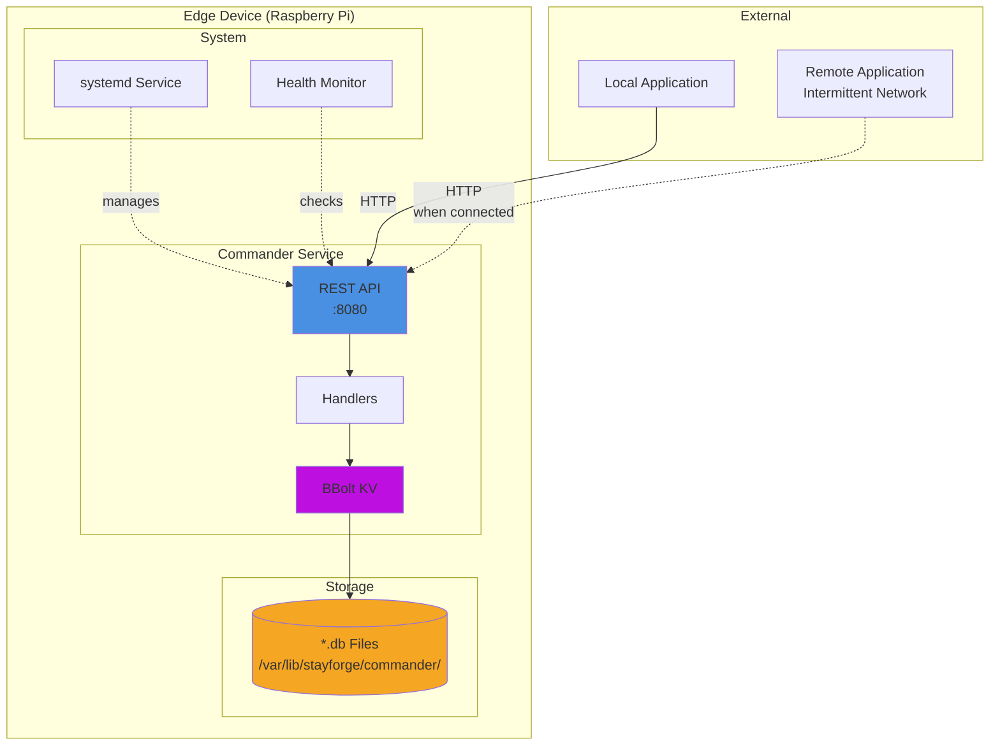

### Cloud Deployment (MongoDB/Redis)

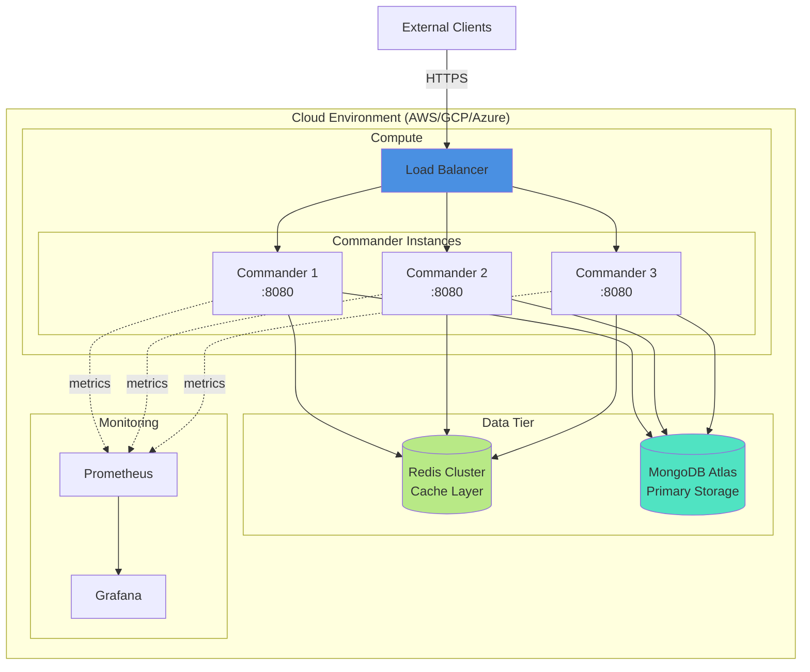

### Hybrid Deployment

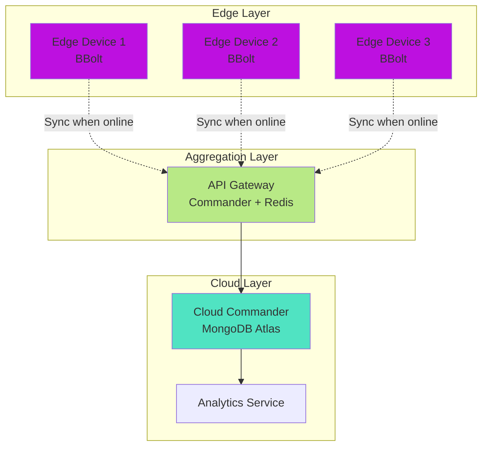

---

## Security Architecture

### Security Layers

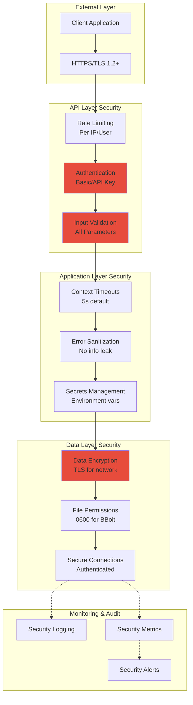

### Authentication Flow (Future)

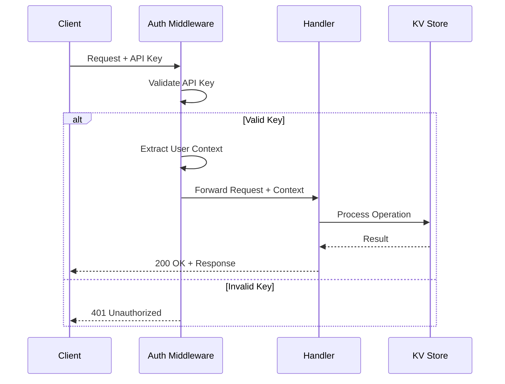

---

## Technology Stack

### Complete Stack Overview

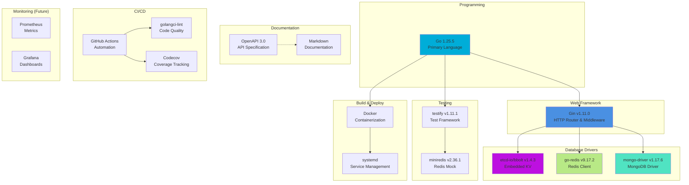

### Dependency Graph

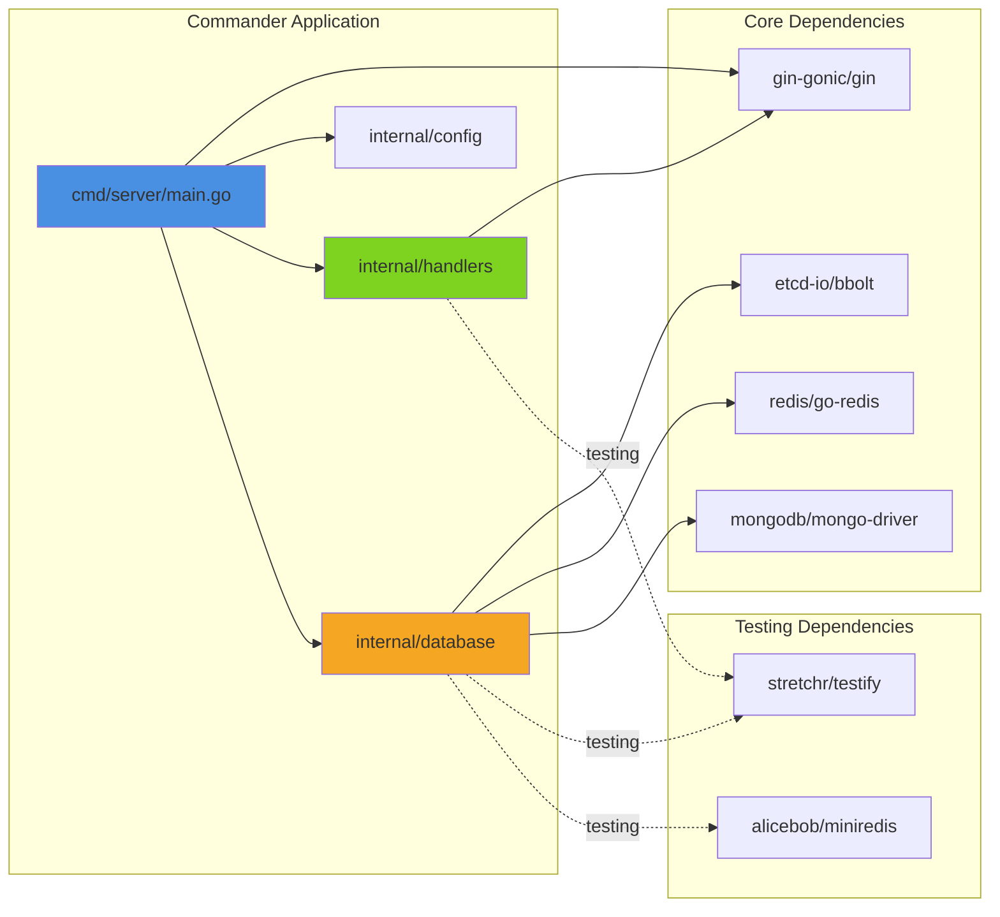

---

## Performance Characteristics

### Response Time Budget (Edge Device)

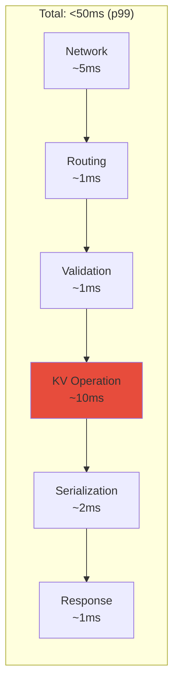

### Resource Usage Targets

| Resource | Target | Maximum |
|----------|--------|---------|
| **Memory** | 50MB | 256MB |
| **Binary Size** | <15MB | <20MB |
| **Startup Time** | <1s | <2s |
| **CPU (idle)** | <5% | <10% |
| **Disk I/O** | Minimal | Moderate |

---

## Design Principles

### SOLID Principles Applied

1. **Single Responsibility**: Each handler does one thing
2. **Open/Closed**: New backends via interface implementation
3. **Liskov Substitution**: All KV implementations interchangeable
4. **Interface Segregation**: KV interface is minimal and focused
5. **Dependency Inversion**: Handlers depend on KV interface, not concrete implementations

### Architectural Patterns

- **Hexagonal Architecture**: Ports (KV interface) and Adapters (implementations)
- **Factory Pattern**: Runtime backend selection
- **Dependency Injection**: KV store injected into handlers
- **Repository Pattern**: KV interface abstracts storage

---

## Future Architecture Evolution

### Phase 2 Enhancements

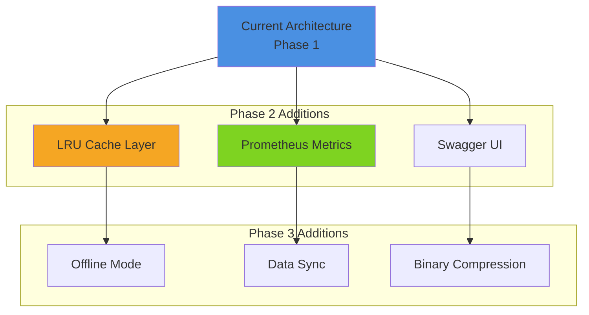

---

## References

- **Project Plan**: `PROJECT_MANAGEMENT_PLAN.md`
- **API Specification**: `api-specification.yaml`
- **KV Usage**: `kv-usage.md`
- **Phase 1 Report**: `PHASE1_COMPLETION.md`
- **Code Rules**: `../.clinerules` and `../.ai-rules/`

---

**Version**: 1.0.0  
**Last Updated**: 2026-02-03  
**Status**: Phase 1 Complete ✅
